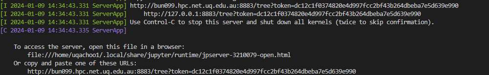

# ktbunya
Simple scripts to help create an interactive session to run jupyter notebooks using UQ's Bunya/Wiener compute.

Only tested on unix. I don't know anything about windows.

## Installation

In your conda environment (e.g. `test`), make sure you have `jupyter` installed and running `python>=3.10`.
```bash
conda create --name test jupyter "python=3.10"
pip install git+https://www.github.com/tuonglab/ktbunya.git
```

## Usage

Create an interactive session with Bunya's cpu/gpu nodes:

### Bunya - CPU or GPU
```bash
# create a simple interactive session with 1 cpu
ixcpu
```

```bash
usage: ixcpu [-h] [--ncpus NCPUS] [--mem MEM] [--mem_per_cpu MEM_PER_CPU] [--nodes NODES] [--ntasks NTASKS] [--account ACCOUNT] [--walltime WALLTIME] [--job_name JOB_NAME] [--gpu] [--gres GRES] [--partition PARTITION] [--qos QOS] [--dryrun]

options:
  -h, --help            show this help message and exit
  --ncpus NCPUS         Number of cpus for job. This is 1 for single core jobs, number of cores for multi core jobs, and 1 for MPI jobs. This can be undertstood as `OMP_NUM_THREADS`.
  --mem MEM             RAM per job given in megabytes (M), gigabytes (G), or terabytes (T). Ask for 2000000M to get the maximum memory on a standard node. Ask for 4000000M to get the maximum memory on a high memory node. Default unit without
                        specifying is in megabytes.
  --mem_per_cpu MEM_PER_CPU
                        Alternative to --mem argument. Only relevant to MPI jobs. Passes to `-mem-per-cpu`.
  --nodes NODES         How many nodes the job will use. Always 1 unless you know what you are doing.
  --ntasks NTASKS       Always 1 unless you know what you are doing. Passes to `--ntasks-per-node`. This is 1 for single core jobs and multi core jobs. This is 96 (or less if single node) for MPI jobs.
  --account ACCOUNT     Account String for your research or accounting group. All Account Strings start with `a_`. Use the `groups` command to list your groups.
  --walltime WALLTIME   Wall time for the session to run (and complete).
  --job_name JOB_NAME   Name of job.
  --gpu                 If passed, submit to gpu queue. Overwrite partition with --partition.
  --gres GRES           GRES syntax. Requires `gpu:[type]:[number]`. Type options for corresponding partitions are: gpu_cuda: h100, l40, a100 gpu_viz: l40 gpu_rocm: mi210 Visit https://github.com/UQ-RCC/hpc-docs/blob/main/guides/Bunya-User-
                        Guide.md for more information.
  --partition PARTITION
                        If passed, overwrite partition.
  --qos QOS             QoS are used to control access to resources and apply sustainable limits. Accepts one of normal, gpu, debug, mig, sxm.
  --dryrun             Print the command that would be run without running it.
```

So, for a typical job where you want something like 24 cores and 32gb of ram, all you need to do is:

```bash
ixcpu --ncpus 24 --mem 32000
```

The default command (just `ixcpu`) runs:
```bash
srun --nodes 1 --ntasks-per-node 1 --job-name interactive_bunya --cpus-per-task 1 --mem 8000 --time 00:10:00 --partition general --qos normal --account a_kelvin_tuong --pty bash
```

You can just tweak this/add on if you require different set up.

If you need GPU, just do:

```bash
ixcpu --gpu
```

This will request `--partition gpu_cuda --gres gpu:h100:1 --qos gpu` by default. Visit https://github.com/UQ-RCC/hpc-docs/blob/main/guides/Bunya-User-Guide.md for more information.

Alternatively, the `ixgpu` command is available as a shortcut for requesting a GPU node. It runs the same command as `ixcpu --gpu`.

```bash
ixgpu
```

`ixgpu` just runs:

```bash
srun --nodes 1 --ntasks-per-node 1 --job-name interactive_bunya --cpus-per-task 1 --mem 8000 --time 00:10:00 --partition gpu_cuda --gres gpu:h100:1 --qos gpu --account a_kelvin_tuong --pty bash
```

Preliminary testing suggest that you don't need to specify `CUDA` version for `pytorch`. To install `pytorch` I just went with:
```
conda install pytorch torchvision torchaudio pytorch-cuda=11.8 -c pytorch -c nvidia
```

You can check in your interactive session in ipython with:
```python
print(
    torch.cuda.is_available(),
    torch.cuda.device_count(),
    torch.cuda.current_device(),
    torch.cuda.get_device_name(0),
)
```


## Launching Jupyter Notebook running on Compute Node on VSCode
```bash
jpynb
```
Run this command on an interactive session (`ixcpu`)

Then it will show:



1. Copy the first link (http://bunXXX.hpc.net.uq.edu.au....)
2. Open the Jupyter Notebook in VSCode
3. Click 'Select Kernel' then 'Existing Jupyter Server' then paste the link and you should be good to go!

To test whether you are on the correct compute node (bun001-bun099):
```py
import socket
socket.gethostname()
```
<b>INFO</b>:

Default port for `jpynb` (for `bunya`) is  `8883`. You can specify a different port number e.g. `jpynb 1234`.
